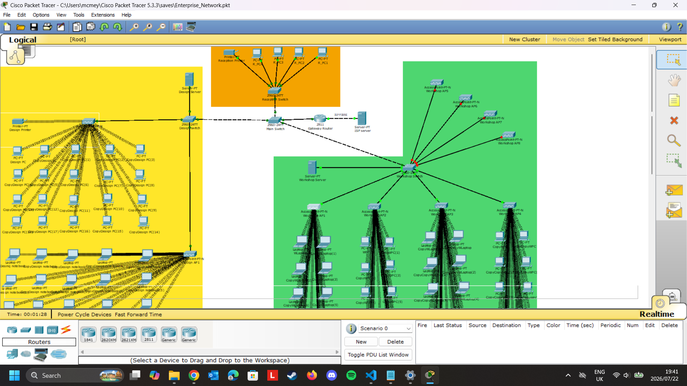
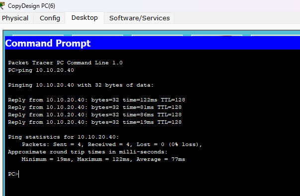
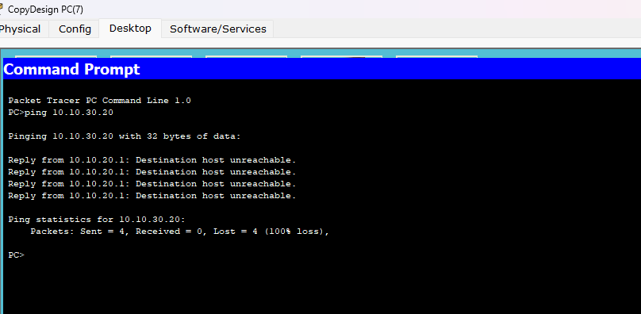

# Business Network Desing using Cisco Packet Tracer

## Overview
This project demonstrates the design and implementation of a secure business network using Cisco Packet Tracer.  It shows practical networking concepts such as VLAN configuration, DHCP, NAT and IP addressing

This network was designed for a business environment consisting of Reception(orange), Design(yellow) and Workshop(green) departments.  The departments were designed to be isolated and only communication within the same department was allowed, while still having access to the internet.

----

## Features
- VLAN implementation for network segmentation
- DHCP configuration for automatic IP address allocation
- NAT configuration for internet access
- Wireless networking using access points
- Department isolation and secure communication

----

## Technologies used
- Cisco Packet Tracer
- VLANs
- DHCP
- NAT
- IPv4 Addressing
- Wireless Networking

## Screenshots

### Network Layout

### VLAN Configuration

### Connectivity Test Within The Same Department

### Connectivity Test Outside Of The Department

## Author 
**MC Meyer**
